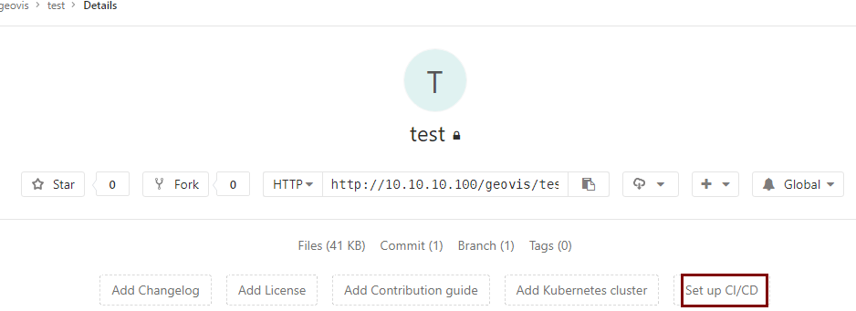
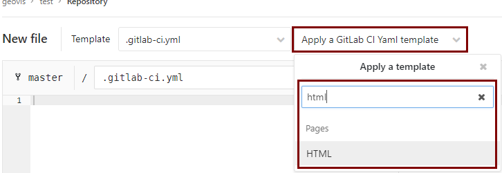
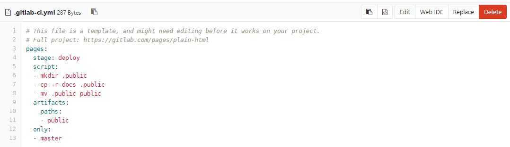
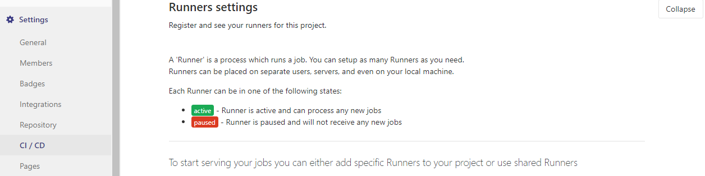

# GitLab CI/CD
## 初始化
- 1、新建项目，访问项目页面，点击`Set up CI/CD`  
 
 

- 2、选择`Apply a GitLab CI Yaml template`，选中`pages->html`  

 

- 3、在模板中添加你的构建流程（如`npm install npm run build `等）

 

- 4、针对`npm`项目，建议添加`cache`缓存`node_modules`
- 5、项目`setting/CI CD`中选择`runner`，找到可用的`runner`并启用，指定`runner（tags）`。
   

## 界面查看